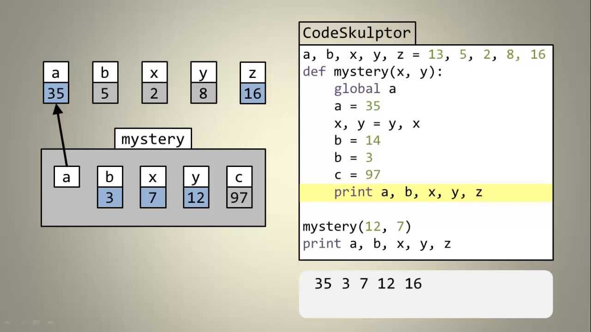

# class 07

## Explain the concept of variable scope in Python and describe the difference between local and global scope. Provide an example illustrating the usage of both

The concept of scope rules how variables and names are looked up in your code. It determines the visibility of a variable within the code. The scope of a name or variable depends on the place in your code where you create that variable

- Global scope: The names that you define in this scope are available to all your code.

- Local scope: The names that you define in this scope are only available or visible to the code within the scope.



## How do the global and nonlocal keywords work in Python, and in what situations might you use them?

- The global keyword is used to define a variable inside a function as a global variable. This means that the variable can be accessed inside another function even if it is not defined inside that function.

- The nonlocal keyword is used to define a variable inside a nested function (function inside a function). This means that the variable can be accessed inside the nested function.

## In your own words, describe the purpose and importance of Big O notation in the context of algorithm analysis

the purpose of Big O notation is to describe the performance or complexity of an algorithm. so we can compare between algorithms and choose the best one, and we can know how much the algorithm will take time to run and how much memory it will take.

## Based on the Rolling Dice Example, explain how you would simulate a dice roll using Python. Describe how you would use code to calculate the probability of rolling a specific number (e.g., the probability of rolling a 6) over a large number of trials

we can modify the example code to take specific number as an argument and divide the number of times the number was rolled by the total number of rolls to get the probability.

```python
import random

def roll():
    return random.randint(1,6)

def count(amount, number):
    count_ = 0

    for i in range(1, amount+1):
        if roll() == number:
            count_ += 1
    return count_ / amount

print(count(10000, 6)) # probability of rolling 6 over 10000 rolls almost equal 0.1667
print(count(10000, 6) + count(10000, 5) + count(10000, 4) + count(10000, 3) + count(10000, 2) + count(10000, 1)) # sum of all probabilities almost equal 1

```
