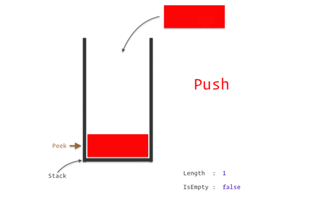

# Class 10 - Stacks and Queues

## Stacks

A stack is a data structure that consists of Nodes. Each Node references the next Node in the stack, but does not reference its previous, it follows the LIFO (Last-In-First-Out) principle.

you can think of it as a stack of books, you can only add a book to the top of the stack, and you can only remove the top book.


## queue

A queue is a linear data structure in computer science that follows the FIFO (First-In-First-Out) principle.

you can think of it as a queue of people waiting for a atm, the first person to arrive is the first person to get served.


## What they are used for

Stacks and queues are used when you need to store and retrieve data in a particular order.

**Stacks** are used for undo and redo operations in text editors, compiler syntax checking, carrying out recursive function calls, depth-first search, and other cases where we care about the last action performed.

**Queues**, meanwhile, are used for asynchronous web service communication, scheduling CPU processes, tracking the N most recently added elements, breadth-first search, and any time we care about servicing requests in the order they’re received.

## Terminology

### stack terminology

**Push** - Nodes or items that are put into the stack are pushed

**Pop** - Nodes or items that are removed from the stack are popped. When you attempt to pop an empty stack an exception will be raised.

**Top** - This is the top of the stack.

**Peek** - When you peek you will view the value of the top Node in the stack. When you attempt to peek an empty stack an exception will be raised.

**IsEmpty** - returns true when stack is empty otherwise returns false.



### queue terminology

**Enqueue** - Nodes or items that are added to the queue.

**Dequeue** - Nodes or items that are removed from the queue. If called when the queue is empty an exception will be raised.

**Front** - This is the front/first Node of the queue.

**Rear** - This is the rear/last Node of the queue.

**Peek** - When you peek you will view the value of the front Node in the queue. If called when the queue is empty an exception will be raised.

**IsEmpty** - returns true when queue is empty otherwise returns false.


## Examples

### stack example

in this example we will implement a stack using a linked list, we will use the top of the stack as the head of the linked list, and we will use the push and pop methods to add and remove nodes from the stack.

```python

class Node:
    def __init__(self, value):
        self.value = value
        self.next = None

class Stack:
    def __init__(self):
        self.top = None

    def push(self, value):
        node = Node(value)
        node.next = self.top
        self.top = node

    def pop(self):
        if self.top:
            temp = self.top
            self.top = self.top.next
            temp.next = None
            return temp.value
        raise Exception('Stack is empty')

    def peek(self):
        if self.top:
            return self.top.value
        raise Exception('Stack is empty')

    def is_empty(self):
        return self.top == None

```

### queue example

in this example we will implement a queue using a linked list, we will use the front of the queue as the head of the linked list, and we will use the enqueue and dequeue methods to add and remove nodes from the queue.

```python

class Node:
    def __init__(self, value):
        self.value = value
        self.next = None

class Queue:
    def __init__(self):
        self.front = None
        self.rear = None

    def enqueue(self, value):
        node = Node(value)
        if self.rear:
            self.rear.next = node
            self.rear = node
        else:
            self.front = node
            self.rear = node

    def dequeue(self):
        if self.front:
            temp = self.front
            self.front = self.front.next
            temp.next = None
            return temp.value
        raise Exception('Queue is empty')

    def peek(self):
        if self.front:
            return self.front.value
        raise Exception('Queue is empty')

    def is_empty(self):
        return self.front == None

```
