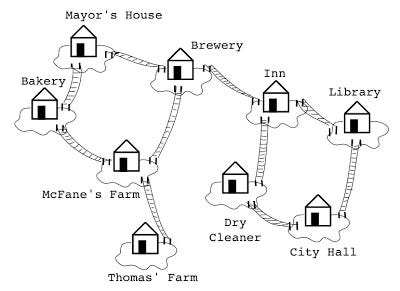
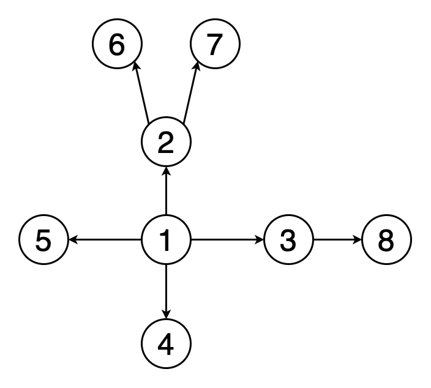

# Class 35 - Graphs

## what is a graph?

Think of a graph data structure like a social network. Each person is a node, and the connections between people are the edges. Just as a social network allows you to see how people are connected and interact with each other, a graph data structure enables you to represent and analyze relationships between different elements in a systematic way.

A graph is a non-linear data structure that can be looked at as a collection of vertices (or nodes) potentially connected by line segments named edges.

## Terminology

- Vertex - A vertex, also called a “node”, is a data object that can have zero or more adjacent vertices.
- Edge - An edge is a connection between two nodes.
- Neighbor - The neighbors of a node are its adjacent nodes, i.e., are connected via an edge.
- Degree - The degree of a vertex is the number of edges connected to that vertex.

## Type of graphs based on the edges

### Directed vs Undirected

#### Undirected Graphs

An Undirected Graph is a graph where each edge is undirected or bi-directional. This means that the undirected graph does not move in any direction.

#### Directed Graphs (Digraph)

A Directed Graph also called a Digraph is a graph where every edge is directed.

Unlike an undirected graph, a Digraph has direction. Each node is directed at another node with a specific requirement of what node should be referenced next.

### Complete vs Connected vs Disconnected

#### Complete Graphs

A complete graph is when all nodes are connected to all other nodes.

#### Connected

A connected graph is graph that has all of vertices/nodes have at least one edge.

#### Disconnected

A disconnected graph is a graph where some vertices may not have edges.

### Acyclic vs Cyclic

#### Acyclic Graph

An acyclic graph is a directed graph without cycles.

A cycle is when a node can be traversed through and potentially end up back at itself.

#### Cyclic Graphs

A Cyclic graph is a graph that has cycles.

An acyclic graph is a directed graph without cycles.

## Why and When Graphs are Used

- Graphs are extremely popular when it comes to it’s uses. Here are just a few examples of graphs in use:
  - GPS and Mapping
  - Driving Directions
  - Social Networks
  - Airline Traffic
  - Netflix uses graphs for suggestions of products
- Graphs are a non-linear data structure that can be traversed to search for a specific element.
They are extremely useful when it comes to modeling relationships between data.
